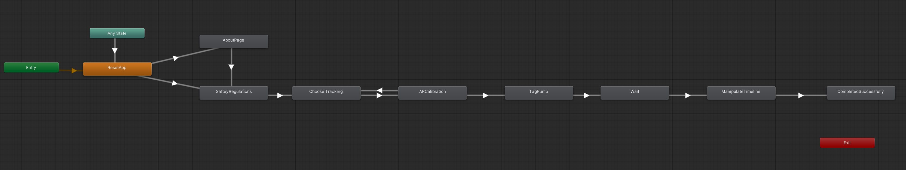

# Development
The application makes use of [Unity AR foundation](https://docs.unity3d.com/Packages/com.unity.xr.arfoundation@4.2/manual/index.html). If you do not have an iOS device on hand you can during development build onto an Android device. Object tracking of the pump will not be supported but you can still place the virtual pump to test out the scenarios.

Most of the project follows standard Unity practices. This page lists some of the exceptions and some additional info to get you started.
We assume you have a basic understanding of Unity and AR Foundation.

## AR setup
To allow for the object tracking of the pump we use https://docs.unity3d.com/Packages/com.unity.xr.arkit@4.0/manual/arkit-object-tracking.html.

In case of issues with tracking you might have to create a new scan of the pump using: https://developer.apple.com/documentation/arkit/scanning_and_detecting_3d_objects.
Alignment of the 3D scan can be done during the scan process itself by changing the pivot location and rotation. As this alignment can be a bit unreliable sometimes you can also override the offset inside the `Tracking controller` script. By adding additional offsets in position and rotation.
This script and all of the other AR scripts can be found in the `main` scene under the `ARSessionOrigin` object.

Aligning the pump is a tedious process as it is done mostly by trial and error. In hindsight creating some tooling around this calibration could save a lot of time.

## Project setup
We rely on the built-in Unity functionality of which some are Unity Packages. The only third-party plugin we rely on is for allowing dictionaries within the inspector of the Editor: https://assetstore.unity.com/packages/tools/utilities/serialized-dictionary-lite-110992. This is a free plugin.

## Components
### Highlights
Highlights are the floating orbs that can be clicked on. Each highlight has at least an information button, most have one or more actions that can be performed. The highlights are linked to specific parts of the pump.

A highlightAnchor script will control the behavior.

### Action
An action is a combination of an operation (predefined enum) and a part type (predefined enum). By combining these a unique action is generated that is later used to allow for validation.

### Info
The info of the highlight is managed using Scriptable Objects. It contains both a title and a body of text. Its goal is to provide additional information about the part

### Consequences
The consequences are linked to highlights and are only shown when the user has failed to perform an action or performed the wrong action.
A consequence contains additional information that is shown to the user to explain what went wrong and what its effect are.

To give the app some more visual appeal some consequences can enable a prefab to be shown. This can be a fire simulation or a water leak using particles.

## State management
There are multiple states that the app can be in. This is controlled by a Unity State Machine. Depending on the actions of the users trigger parameters are set to continue to the next state.

States:
 - About page
 - Safety regulations page
 - Choose tracking page
   - Choice between object tracking or virtual AR pump
 - ARCalibration phase
   - Object tracking: searches for the physical pump
   - Virtual AR pump: looking for 3D surfaces on which the pump can be placed
 - Tag Pump phase
 - Wait phase
   - During this phase the user explores the pump and can perform actions on it
 - Edit Timeline phase
   - User has a second chance to correct mistakes
 - Completed phase

At any state the user can revert the app to the safety regulations page.

Scripts on the various states will trigger the changes in the UI state. Once a trigger param is toggled by a user action the next state will automatically be triggered.

The full flow of the app is as follows:

## UI
Most of the UI is made up of basic Unity UI components. However, the action toolbar is a bit more unique. Every action that a user takes is added sequentially to this toolbar as a history of actions. After pressing the `Valideer inspectie` button each action is evaluated. Invalid actions will trigger a consequence and add the mistake info to each highlight.

It's made up of two parts:
  - The world space canvas: shows the AR overlay elements
  - The main canvas: shows the flat interactable UI elements

> The order of the actions is no longer important but some legacy code remains of when we did require a specific order of actions.

## iOS builds
The app is built and signed with an ad-hoc certificate for the iOS platform. The signing is only valid for the Acta vzw iPad and expires after a year.
The following documention can be used to reproduce: https://docs.unity3d.com/Manual/UnityCloudBuildiOS.html. You can skip the update Unity Cloud build step and perform this action in Xcode.

The app is not published to the app store.
