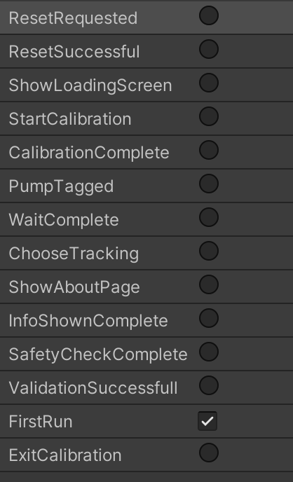

# Opleiden 4.0 - AR

The opleiden 4.0 - AR proof of concept aims to stimulate new learning experiences in the industry.

Project partners: imec, KdG, Catalisti, Acta

## About

This Unity app is designed specifically for an iPad pro 11-inch 1st	generation.
The UI and AR capabilities of the app were never not designed to work on other devices.

## Technical Setup
As we make use of Unity AR foundation, for solely development purposes you can also build onto an Android device. While object tracking of the pump will not be supported, you can still place the virtual pump to test out the scenarios.

To allow for the object tracking of the pump we use https://docs.unity3d.com/Packages/com.unity.xr.arkit@4.0/manual/arkit-object-tracking.html.

In case of issues with tracking you might have to recreate a new scan of the pump using: https://developer.apple.com/documentation/arkit/scanning_and_detecting_3d_objects.

### Project
We rely on the built-in Unity functionality of which some are Unity Packages. The only third party plugin we rely on is for allowing dictionaries within the inspector of the Edito: https://assetstore.unity.com/packages/tools/utilities/serialized-dictionary-lite-110992. This is a free plugin.

### Highlights
Highlights are the floating orbs that can be clicked on. Each highlight has at least an information action, most have one or more actions that can be performed. The highlights are linked to specific parts of the pump.

#### Info
The info of the highlight is managed using Scriptable Objects. It contains both a title and a body of text.

#### Consequences
The consequences are linked to highlights and are only shown when the user has failed to perform an action or performed the wrong action.
A consequence contains additional information that is shown to the user to explain what went wrong and what it's effect are.

To give the app some more visual appeal some consequences can enable a prefab to be shown. This can be a fire simulation or a water leak using particles.

### State management
There are multiple states that the app can be in. The is controlled by a Unity State Machine. Depending on the actions of the users trigger paramaters are set to continue to the next state.

States:
 - About page
 - Safety regulations page
 - Choose tracking page
   - Choice between object tracking or virtual AR pump
 - ARCalibration phase
   - Object tracking: searches for the the physical pump
   - Virtual AR pump: looking for 3D surfaces on which the pump can be placed
 - Tag Pump phase
 - Wait phase
   - During this phase the user explores the pump and can perform actions on it
 - Edit Timeline phase
   - User has a second chance to correct mistakes
 - Completed phase

At any state the user can revert the app to the safety regulations page.

The full flow of the app is as follows:

